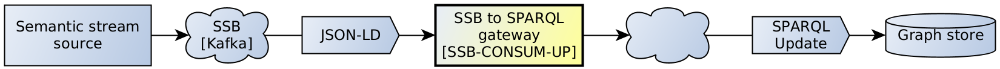

# ssb-consum-up (scu)

A Semantic Service Bus (SSB) consumer to SPARQL Update.

The *scu* solution consumes Kafka messages from some topic where the *<k,v>* message structure contains RDF data in JSON-LD syntax.

* *v (value)*: graph data payload, whether part or not of a named graph (i.e. derived from N-Quads or Trig data *vs* derived from triples )
* *k (key)*: optional metadata for complementary downstream SPARQL Update behavior configuration, such as providing the SPARQL Update action to use, a payload provenance, etc.

Processed semantic messages trigger SPARQL Update queries to some downstream SPARQL end point, thus enabling tasks such as inserting streams of RDF data.

Additional upstream processing (e.g. message filtering at the Kafka engine level) or downstream architectures (e.g. 1 topic to multiple end points) can be tought of with the SCU solution, although this discussion falls out of the scope of this code repository.

## Features

*WIP*

## Quick-start

*WIP*

## Usage

*WIP*

## Learn

*WIP*

## Contribute

In the general case, please
* *fork and create merge request* OR
* *raise an issue* into the project's space OR
* improve code based on in-code `TODO` notes.

See also the `makefile` for development and testing purposes.

## Copyright

Copyright (c) 2022-2023, Orange. All rights reserved.

## License

[LICENSE.txt](LICENSE.txt).

## Maintainer

* [Lionel TAILHARDAT](mailto:lionel.tailhardat@orange.com)
* [Yoan CHABOT](mailto:yoan.chabot@orange.com)
* [Raphaël TRONCY](mailto:raphael.troncy@eurecom.fr)